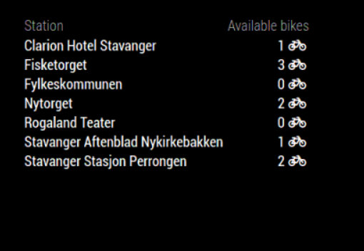

# MagicMirror2 Module: StavangerCityBike

`MMM-StavangerCityBike` is a module for displaying CityBike availability in Stavanger and is inspired by [OsloCityBike](https://github.com/TobbenTM/MMM-OsloCityBike) by [TobbenTM](https://github.com/TobbenTM).



## Installation

```bash
cd ~/MagicMirror/modules
git clone https://github.com/exoen/MMM-StavangerCityBike
```

Add the module to the modules array in `~/MagicMirror/config/config.js`, e.g.,

```javascript
{
    modules:
    [
        {
            module: "MMM-StavangerCityBike",
            position: "top_left",
            config: {
                 stationsToInclude: [69, 72],
                 stationsToExclude: [55],
                 availabilityReloadInterval: 300000,
                 stationInfoReloadInterval: 86400000,
                    area: {
                        lat: '58.967',
                        lng: '5.732',
                        radiusInMeters: 500
                }
            }
        }
    ]
}
```

## Configuration options

Configuration Options      | Comment                                                                                   |  Default
-------------------------- | ----------------------------------------------------------------------------------------- | -------:
stationsToInclude          | Id of stations to explicitly include                                                      |       []
stationsToExclude          | Id of stations to explicitly exclude                                                      |       []
availabilityReloadInterval | Update interval in milliseconds of available bikes. Defaults to five minutes              |   300000
stationInfoReloadInterval  | Update interval in milliseconds of station info, e.g., station names. Defaults to one day | 86400000
area                       | Object that defines an area to include bike stations. See below                           |       na

Area Configuration | Comment
------------------ | -------------------------------------------------------------------
lat                | Latitude
lng                | Longitude
radiusInMeters     | Radius in meters to include bike stations from the lat/lng position

The haversine formula is used to compute the distance, as the crow flies, between the specified area and bike stations.
